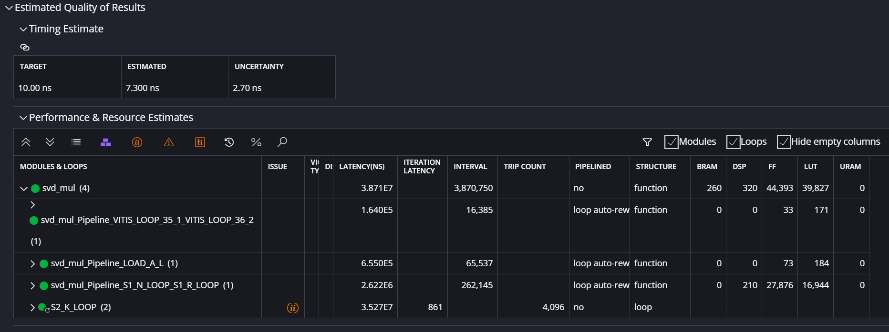

# Exploration with SVD

Comparing tiled matmul and SVD matmul for Mamba models.

## Parameters

- sequence length = 64
- model dimension = 1024
- expansion factor = 2

The opration would be [64, 1024] x [1024, 4096] -> [64, 4096]

## Tiled approach

- A is small so it used loaded on chip
- This cached tile is reused 4096 times
- Complexity: O(M x N x K) = 268 Million Ops.

## SVD

- A is small so it used loaded on chip
- Rank of Weight matrix assumed to be 256. Value should be lesser than 820
- Intermediate buffer used [64, 256] to keep it fast
- Complexity: O(M x N x R) + O(M x R x K) = 83 Million Ops.

## Results

